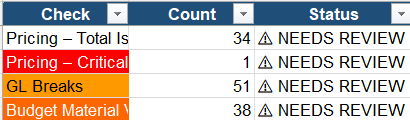
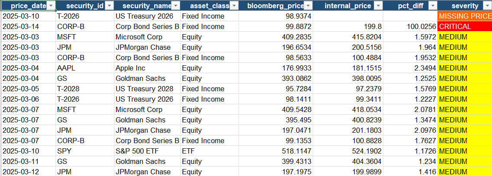
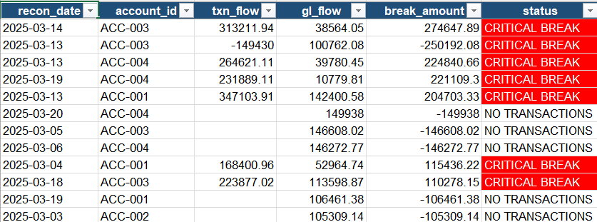
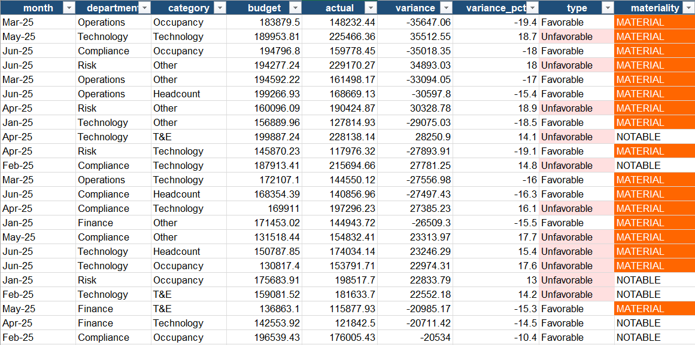
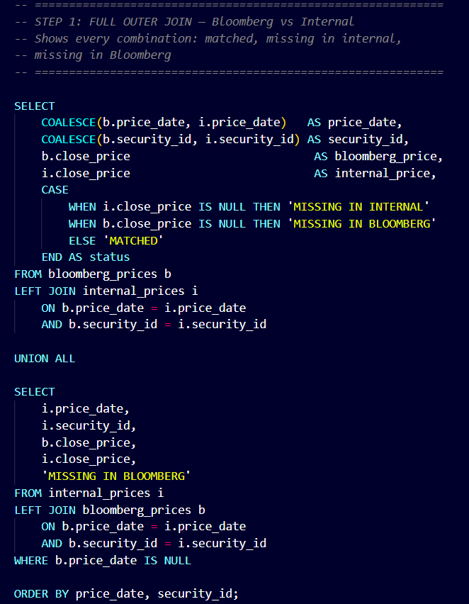

# Financial Reconciliation Automation

> End-to-end automation of daily financial operations reconciliation — securities pricing QA, GL break detection, and budget variance analysis — using SQL, Python, and Excel.

Built to reflect the reconciliation workflows common in financial operations, wealth management, and fund accounting roles. The pipeline ingests raw CSV data, runs multi-layered SQL checks, and produces a formatted, color-coded Excel report — fully automated, no manual steps.

---

## What Problems This Solves

Manual reconciliation is slow, error-prone, and doesn't scale. This project automates three checks that are typically done by hand in financial ops roles:

| Problem | What This Does |
|---------|---------------|
| Vendor prices don't always match what loads into internal systems | Compares external vs internal prices daily, flags discrepancies by severity |
| Trade records and GL postings can get out of sync | Detects breaks between transactions and GL entries, tracks aging |
| Department spend drifts from budget with no early warning | Flags material variances before they compound, shows month-over-month trend |

---

## Screenshots

### Dashboard — cross-module summary


### Pricing Detail — severity-flagged discrepancies


### GL Reconciliation — account-level break detection


### Budget Variance — department and category-level spend vs plan


### SQL — FULL OUTER JOIN simulated in SQLite via UNION ALL


---

## Tech Stack

| Layer | Tool | Role |
|-------|------|------|
| Database | SQLite 3 | File-based, zero-config — schema and data loaded via `.sql` scripts |
| Query language | SQL | CTEs, window functions, outer joins, conditional aggregation |
| Automation | Python 3.7+ | Orchestrates all SQL queries end-to-end via `sqlite3` stdlib module |
| Data manipulation | pandas | DataFrame merges, groupby aggregations, variance calculations |
| Excel output | openpyxl | Programmatic workbook construction with per-cell conditional formatting |
| Data format | CSV | Six flat files as raw data source, loaded into SQLite at runtime |

### SQL — techniques used

- **CTEs (`WITH` clause)** — multi-step logic broken into named blocks rather than nested subqueries; each step is independently readable and testable
- **FULL OUTER JOIN (simulated)** — SQLite doesn't support it natively, so it's replicated using two `LEFT JOIN`s combined with `UNION ALL` — one join from each direction
- **`LEFT JOIN`** — finds securities present in the vendor feed but absent from the internal system (missing price loads)
- **`CASE WHEN`** — drives all severity classification (CRITICAL / HIGH / MEDIUM / OK) based on configurable percentage thresholds
- **Window functions** — `SUM() OVER (PARTITION BY ... ORDER BY ...)` for running YTD totals; `LAG()` for prior-day price comparison to catch outlier moves even when both sources agree
- **`COALESCE`** — gracefully handles NULLs from outer joins when one side of the match is absent
- **Conditional aggregation** — `SUM(CASE WHEN txn_type = 'BUY' THEN amount END)` pivots transaction types into columns within a single `GROUP BY`

### Python — techniques used

- **`sqlite3` (stdlib)** — connects to the database and executes each `.sql` script, returning results as cursor objects
- **`pandas`** — reads query results into DataFrames; handles percentage formatting, variance calculations, and summary rollups that are cleaner in Python than SQL
- **`openpyxl` Workbook API** — builds the Excel report programmatically: creates sheets, writes headers, applies `PatternFill` and `Font` color per cell based on severity flags, auto-sizes column widths

### Excel output — what's generated

- 5-tab workbook built entirely in code — no manual formatting required
- Per-cell `PatternFill` conditional formatting driven by severity flags returned from SQL
- Dashboard tab aggregates issue counts across all three reconciliation modules
- Drop-in ready for daily ops use — rerun the script, get a fresh report

---

## Reconciliation Modules

**1. Securities Pricing Reconciliation**
Compares end-of-day prices from an external vendor against internal system prices. Catches missing loads, fat fingers, decimal shifts, and 10x errors. Flags day-over-day outliers even when both sources agree — a signal the market move itself may need review.

**2. GL vs Transaction Reconciliation**
Every trade must have a matching GL posting. This module finds breaks in both directions, calculates the dollar impact, and tracks how long each break has been open. Older breaks = higher risk.

**3. Budget vs Actuals Variance Analysis**
Tracks departmental spend against plan at the line item level. Flags MATERIAL variances (>15%), rolls up by category (Headcount, T&E, Technology, etc.), and shows whether variance is improving or worsening month over month via window functions.

---

## Errors Injected Into the Data

The dataset includes deliberate errors so the queries have real problems to catch — not just clean data that always reconciles:

| Security | Date | Error Type | Detail |
|----------|------|-----------|--------|
| AAPL | 2025-03-05 | Fat finger | $178.00 entered as $89.50 |
| T-2026 | 2025-03-10 | Missing price | Row never loaded into internal system |
| CORP-B | 2025-03-14 | 10x error | $99.80 entered as $199.80 |
| SPY | 2025-03-18 | Decimal shift | $523.40 entered as $53.40 |
| GL / ACC-003 | 2025-03-12 | GL break | GL posting $5,000 higher than transaction record |

---

## Project Structure

```
recon_project/
│
├── data/
│   ├── securities_master.csv
│   ├── bloomberg_prices.csv
│   ├── internal_prices.csv
│   ├── transactions.csv
│   ├── gl_entries.csv
│   └── budget_vs_actuals.csv
│
├── sql/
│   ├── 01_setup_tables.sql
│   ├── 02_pricing_reconciliation.sql
│   ├── 03_gl_transaction_reconciliation.sql
│   └── 04_budget_variance_analysis.sql
│
├── assets/
│   └── screenshots/
│
├── run_reconciliation.py
└── output/
    └── daily_recon_report.xlsx
```

---

## Quickstart

### Python — full pipeline + Excel report

```bash
pip install pandas openpyxl
python run_reconciliation.py
```

Produces `output/daily_recon_report.xlsx` with 5 tabs: Dashboard, Pricing Summary, Pricing Detail, GL Reconciliation, Budget Variance.

### SQL only — run queries manually in SQLite

```bash
sqlite3 recon.db < sql/01_setup_tables.sql
sqlite3 recon.db < sql/02_pricing_reconciliation.sql
sqlite3 recon.db < sql/03_gl_transaction_reconciliation.sql
sqlite3 recon.db < sql/04_budget_variance_analysis.sql
```

---

## Excel Report Tabs

| Tab | Contents |
|-----|---------|
| Dashboard | Issue counts across all three modules |
| Pricing Summary | Daily error rate and critical flag count |
| Pricing Detail | Every security, every day — severity flagged |
| GL Reconciliation | Every account, every day — reconciled or break |
| Budget Variance | Line-level budget vs actual with materiality flags |

Color coding:
- 🔴 CRITICAL / BREAK — immediate action required
- 🟠 HIGH / MATERIAL — investigate same day
- 🟡 MEDIUM / NOTABLE — review and document
- ⚪ OK / Reconciled

---

## Data Dictionary

**securities_master** — `security_id`, `security_name`, `asset_class`, `currency`, `exchange`

**bloomberg_prices / internal_prices** — `price_date`, `security_id`, `close_price`, `source`

**transactions** — `txn_id`, `txn_date`, `txn_type` (BUY/SELL/DIVIDEND/COUPON), `quantity`, `amount`, `account_id`

**gl_entries** — `gl_id`, `entry_date`, `account_id`, `debit`, `credit`

**budget_vs_actuals** — `month`, `department`, `category`, `budget_amount`, `actual_amount`

---

## Requirements

- Python 3.7+
- `pandas`, `openpyxl` (`pip install pandas openpyxl`)
- SQLite 3 (pre-installed on Mac/Linux; [download for Windows](https://sqlite.org/download.html))
